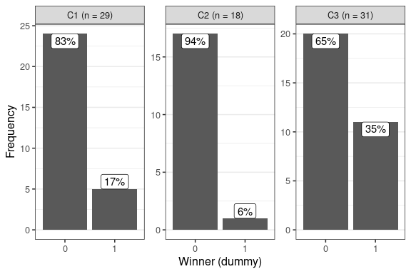
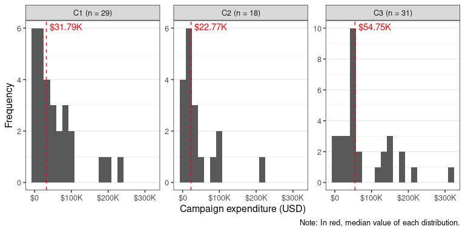
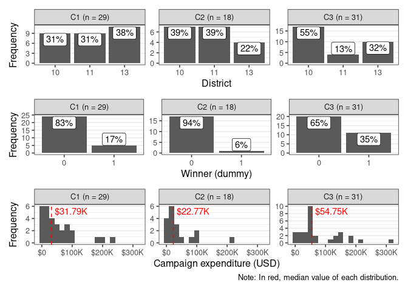

Analyze clusters
================

## Load packages and data

Load packages:

``` r
library(tidyverse)
library(glue)
library(here)
```

Load data:

``` r
candidates <- read_rds(here("proc", "02_fb_data_candidate_nse.rds")) %>% 
  # only keep Políticamente candidates (for which we have hand-coded post intentions)
  filter(d_pol == 1L)
```

## Generate clusters

Create % version of factor variables:

``` r
candidates2 <- candidates %>% 
  # exclude deployment posts from "campaign" ones
  mutate(n_posts_campaign = n_posts_campaign - n_posts_deployment) %>% 
  mutate_at(
    vars(n_posts_programmatic, n_posts_campaign, 
         n_posts_politics, n_posts_deployment),
    list(pct = ~ 100 * . / n)
  )
```

Calculate k-means with k = 3, k = 4 and k = 5:

``` r
f_kmeans <- function(k){
  set.seed(2017)
  kmeans(candidates2 %>% 
           select(n, matches("n_posts.*_pct")) %>%
           mutate_all(~scale(.)), 
         centers = k, nstart = 100)$cluster
}
```

``` r
candidates3 <- candidates2
for (i in 3:5){
  `<-`(
    candidates3[[as.character(glue("cluster_k{i}"))]], f_kmeans(k = i)
  )
}
```

Get number of candidates per cluster, with the different k
specifications:

``` r
candidates3 %>% 
  count(cluster_k3, wt = n())
```

    ## # A tibble: 3 x 2
    ##   cluster_k3     n
    ##        <int> <int>
    ## 1          1    29
    ## 2          2    18
    ## 3          3    31

``` r
candidates3 %>% 
  count(cluster_k4, wt = n())
```

    ## # A tibble: 4 x 2
    ##   cluster_k4     n
    ##        <int> <int>
    ## 1          1    18
    ## 2          2    34
    ## 3          3    24
    ## 4          4     2

``` r
candidates3 %>% 
  count(cluster_k5, wt = n())
```

    ## # A tibble: 5 x 2
    ##   cluster_k5     n
    ##        <int> <int>
    ## 1          1     2
    ## 2          2    27
    ## 3          3    17
    ## 4          4    13
    ## 5          5    19

We’ll select the k=3 specification:

``` r
candidates3$cluster_sel <- candidates3$cluster_k3
```

Add cluster labels to the dataset:

``` r
candidates4 <- candidates3 %>% 
  left_join(candidates3 %>% 
              count(cluster_k3, wt = n()) %>% 
              select(cluster_sel = cluster_k3, n_cl = n)) %>% 
  mutate(cluster_sel = str_c("C", cluster_sel, " (n = ", n_cl, ")"))
```

    ## Joining, by = "cluster_sel"

Table of candidates, with clusters:

``` r
candidates4 %>% 
  select(cluster_sel, candidate, candidate_district, 
         party, votes_pct, d_elected) %>% 
  mutate(votes_pct = round(votes_pct, 2)) %>% 
  arrange(cluster_sel, candidate_district, -d_elected, -votes_pct)
```

    ## # A tibble: 78 x 6
    ##    cluster_sel candidate           candidate_district party  votes_pct d_elected
    ##    <chr>       <chr>                            <dbl> <chr>      <dbl>     <dbl>
    ##  1 C1 (n = 29) SEBASTIAN TORREALBA                 10 RN          2.34         1
    ##  2 C1 (n = 29) CLAUDIO ARRIAGADA                   10 PDC         4.13         0
    ##  3 C1 (n = 29) DAUNO TOTORO                        10 IND         1.69         0
    ##  4 C1 (n = 29) PEDRO GARCIA                        10 PDC         0.7          0
    ##  5 C1 (n = 29) VERONICA PINILLA                    10 PPD         0.54         0
    ##  6 C1 (n = 29) CAROLA SOLIS                        10 PRSD        0.48         0
    ##  7 C1 (n = 29) ANDREA DUARTE                       10 PRO         0.46         0
    ##  8 C1 (n = 29) JORGE ARROYO                        10 PRO         0.21         0
    ##  9 C1 (n = 29) RODOLFO CHELME                      10 PRO         0.15         0
    ## 10 C1 (n = 29) FRANCISCO UNDURRAGA                 11 EVOPO…     15.6          1
    ## # … with 68 more rows

# Plots in white paper

## Fig. 3: Distributions of factors, divided by cluster

``` r
factors_long <- candidates4 %>% 
  pivot_longer(cols = c(n, matches("n_posts.*_pct")), 
               names_to = "var_clustering",
               values_to = "value") %>% 
  mutate(var_clustering = var_clustering %>% 
           str_remove("n_posts_")) %>% 
  select(cluster_sel, var_clustering, value) %>%
  mutate(var_clustering = case_when(
    var_clustering == "n" ~ "Number of posts",
    var_clustering == "programmatic_pct" ~ "% Programmatic",
    var_clustering == "campaign_pct" ~ "% Mobilization",
    var_clustering == "politics_pct" ~ "% Coattail effect",
    var_clustering == "deployment_pct" ~ "% Deployment"
  ))
```

``` r
median_values_per_cluster <- factors_long %>% 
  group_by(var_clustering, cluster_sel) %>% 
  summarize(m = median(value)) %>% 
  ungroup()
```

``` r
fig3 <- ggplot(factors_long, aes(x = value)) +
  geom_histogram(bins = 20) +
  geom_vline(data = median_values_per_cluster, aes(xintercept = m),
             color = "red", linetype = "dashed") +
  geom_text(data = median_values_per_cluster, 
            aes(x = m, y = Inf, label = formatC(m, 2, format = "f")),
            color = "red", size = 5, vjust = 1.5, hjust = -0.25) +
  facet_grid(cluster_sel ~ fct_relevel(var_clustering,
                                       "Number of posts", "% Programmatic",
                                       "% Mobilization", "% Coattail effect"), 
             scales = "free") +
  scale_y_continuous(breaks = scales::breaks_extended(Q = c(1, 5, 2, 4, 3))) +
  labs(x = "Value", y = "Frequency", 
       title = "Distributions of factors, divided by cluster",
       caption = "Note: In red, median value of each distribution.") +
  theme_bw(base_size = 16) +
  theme(axis.text.x = element_text(angle = 0)) 
fig3
```

<!-- -->

``` r
ggsave(plot = fig3, filename = here("output", "03_fig3_clusters_factors.png"),
       width = 12, height = 5)
```

## Fig. 6: Distributions of campaign-related variables, divided by cluster

``` r
context_cat_long <- candidates4 %>% 
  mutate_at(vars(d_elected, d_incumbent_gen, d_female, candidate_district), 
            as.character) %>% 
  pivot_longer(cols = c(coalition, d_elected, d_incumbent_gen, 
                        d_female, candidate_district), 
               names_to = "var_clustering",
               values_to = "value")

p_cat <- context_cat_long %>% 
  count(cluster_sel, var_clustering, value, wt = n()) %>% 
  group_by(cluster_sel, var_clustering) %>% 
  mutate(perc = 100 * n / sum(n))
```

### A. District

``` r
df_fig6_district <- p_cat %>% 
  ungroup() %>% 
  filter(var_clustering == "candidate_district")
```

``` r
number_si <- scales::label_number_si(accuracy = 0.01)
fig6_district <- ggplot(
  df_fig6_district, 
  aes(x = value, y = n, label = str_c(formatC(perc, 0, format = "f"), "%"))
) +
  geom_col() +
  geom_label(vjust = "inward") +
  facet_wrap(~cluster_sel, scales = "free") +
  scale_y_continuous(breaks = scales::breaks_extended(Q = c(1, 5, 2, 4, 3))) +
  labs(x = "District", y = "Frequency") +
  theme_bw(base_size = 12) +
  theme(axis.text.x = element_text(angle = 0), 
        panel.grid.major.x = element_blank(),
        panel.grid.minor.x = element_blank()) 

fig6_district
```

<!-- -->

### B. Winners

``` r
df_fig6_winners <- p_cat %>% 
  ungroup() %>% 
  filter(var_clustering == "d_elected")
```

``` r
number_si <- scales::label_number_si(accuracy = 0.01)
fig6_winners <- ggplot(df_fig6_winners, 
                       aes(x = value, y = n, 
                           label = str_c(formatC(perc, 0, format = "f"), "%"))) +
  geom_col() +
  geom_label(vjust = "inward") +
  facet_wrap(~cluster_sel, scales = "free") +
  scale_y_continuous(breaks = scales::breaks_extended(Q = c(1, 5, 2, 4, 3))) +
  labs(x = "Winner (dummy)", y = "Frequency") +
  theme_bw(base_size = 12) +
  theme(axis.text.x = element_text(angle = 0), 
        panel.grid.major.x = element_blank(),
        panel.grid.minor.x = element_blank()) 

fig6_winners
```

<!-- -->

### C. Campaign expenditures

``` r
context_num_long <- candidates4 %>% 
  mutate(age = (lubridate::ymd("2019-08-18") - candidate_birth) %>% 
           as.numeric() %>% 
           {. / 365}) %>% 
  mutate(spending_total = as.numeric(spending_total),
         spending_socialmedia_pct = as.numeric(spending_socialmedia_pct)) %>% 
  pivot_longer(cols = c(mean_nse, spending_total, votes_pct, n_tweets, age), 
               names_to = "var_clustering", values_to = "value")
```

``` r
expenditure_long <- context_num_long %>% 
  filter(var_clustering == "spending_total") %>% 
  select(cluster_sel, value) %>% 
  mutate(value = value / 630.41)
```

``` r
median_values_per_cluster_exp <- expenditure_long %>% 
  group_by(cluster_sel) %>% 
  summarize(m = median(value, na.rm = T)) %>% 
  ungroup()
```

``` r
number_si <- scales::label_number_si(accuracy = 0.01)

label_number_si_usd <- function (accuracy = 1, unit = NULL, sep = NULL, ...) 
{
  sep <- if (is.null(unit)) 
    ""
  else " "
  scales:::force_all(accuracy, ...)
  function(x) {
    breaks <- c(0, 10^c(K = 3, M = 6, B = 9, T = 12))
    n_suffix <- cut(abs(x), breaks = c(unname(breaks), Inf), 
      labels = c(names(breaks)), right = FALSE)
    n_suffix[is.na(n_suffix)] <- ""
    suffix <- paste0(sep, n_suffix, unit)
    scale <- 1/breaks[n_suffix]
    scale[which(scale %in% c(Inf, NA))] <- 1
    str_c("$", scales:::number(x, accuracy = accuracy, scale = unname(scale), 
                               suffix = suffix, ...))
  }
}

fig6_expenditure <- ggplot(expenditure_long, aes(x = value)) +
  geom_histogram(bins = 20) +
  geom_vline(data = median_values_per_cluster_exp, aes(xintercept = m),
             color = "red", linetype = "dashed") +
  geom_text(data = median_values_per_cluster_exp, 
            aes(x = m, y = Inf, label = str_c("$", number_si(m))),
             color = "red", vjust = 1.5, hjust = -0.1) +
  facet_wrap(~cluster_sel, scales = "free_y") +
  scale_x_continuous(labels = label_number_si_usd()) +
  scale_y_continuous(breaks = scales::breaks_extended(Q = c(1, 5, 2, 4, 3))) +
  labs(x = "Campaign expenditure (USD)", y = "Frequency", 
       caption = "Note: In red, median value of each distribution.") +
  theme_bw(base_size = 12) +
  theme(axis.text.x = element_text(angle = 0), 
        panel.grid.major.x = element_blank(),
        panel.grid.minor.x = element_blank()) 

fig6_expenditure
```

<!-- -->

### D. Combined

``` r
library(patchwork)
```

``` r
fig6_combined <- fig6_district / fig6_winners / fig6_expenditure

fig6_combined
```

<!-- -->

``` r
ggsave(plot = fig6_combined + plot_annotation(title = "Distribution of campaign-related variables, divided by cluster"), 
       filename = here("output", "03_fig6_clusters_campaign_vars.png"), 
       width = 6, height = 7)
```

## Fig. 4: Distributions of candidate-related variables, divided by cluster

### A. Age

``` r
age_long <- context_num_long %>% 
  filter(var_clustering == "age") %>% 
  select(cluster_sel, value = value)
```

``` r
median_values_per_cluster_age <- age_long %>% 
  group_by(cluster_sel) %>% 
  summarize(m = median(value, na.rm = T)) %>% 
  ungroup()
```

``` r
number_si <- scales::label_number_si(accuracy = 0.01)

fig4_age <- ggplot(age_long, aes(x = value)) +
  geom_histogram(bins = 20) +
  geom_vline(data = median_values_per_cluster_age, aes(xintercept = m),
             color = "red", linetype = "dashed") +
  geom_text(data = median_values_per_cluster_age, 
            aes(x = m, y = Inf, label = number_si(m)),
             color = "red", vjust = 1.5, hjust = -0.25) +
  facet_wrap(~cluster_sel, scales = "free_y") +
  scale_x_continuous(labels = scales::label_number_si()) +
  scale_y_continuous(breaks = scales::breaks_extended(Q = c(1, 5, 2, 4, 3))) +
  labs(x = "Age", y = "Frequency", 
       caption = "Note: In red, median value of each distribution.") +
  theme_bw(base_size = 12) +
  theme(axis.text.x = element_text(angle = 0), 
        panel.grid.major.x = element_blank(),
        panel.grid.minor.x = element_blank()) 

fig4_age
```

<!-- -->

### B. Gender

``` r
df_fig4_gender <- p_cat %>% 
  ungroup() %>% 
  filter(var_clustering == "d_female")
```

``` r
number_si <- scales::label_number_si(accuracy = 0.01)
fig4_gender <- ggplot(df_fig4_gender, 
                       aes(x = value, y = n, 
                           label = str_c(formatC(perc, 0, format = "f"), "%"))) +
  geom_col() +
  geom_label(vjust = "inward") +
  facet_wrap(~cluster_sel, scales = "free") +
  scale_y_continuous(breaks = scales::breaks_extended(Q = c(1, 5, 2, 4, 3))) +
  labs(x = "Female (dummy)", y = "Frequency") +
  theme_bw(base_size = 12) +
  theme(axis.text.x = element_text(angle = 0), 
        panel.grid.major.x = element_blank(),
        panel.grid.minor.x = element_blank()) 

fig4_gender
```

<!-- -->

### C. Combined

``` r
fig4_combined <- fig4_age / fig4_gender
```

``` r
ggsave(plot = fig4_combined + plot_annotation(title = "Distribution of candidate-related variables, divided by cluster"), 
       filename = here("output", "03_fig4_clusters_candidate_vars.png"), 
       width = 6, height = 5)
```

## Generate output datasets

Candidates:

``` r
write_rds(
  candidates4 %>% select(-starts_with("cluster_k"), -matches("n_posts.*_pct")),
  here("proc", "03_facebook_data_candidate_nse_cl.rds")
)
```

Posts:

``` r
read_rds(here("proc", "02_fb_data_posts_nse.rds")) %>% 
  left_join(candidates4 %>% select(candidate_id, cluster_sel, n_cl)) %>% 
  write_rds(here("proc", "03_facebook_data_posts_nse_cl.rds"))
```

    ## Joining, by = "candidate_id"
