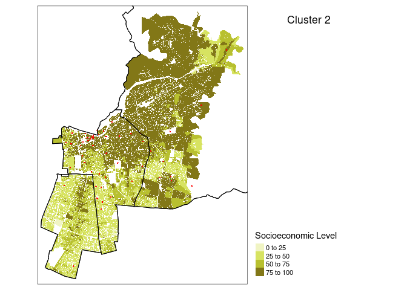
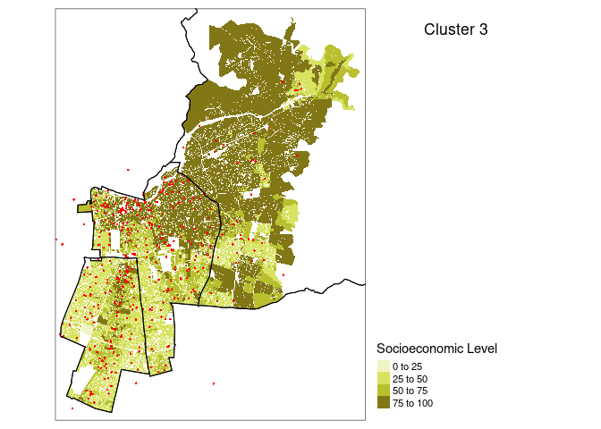

Analyze geo data
================

### Load libraries

``` r
library(dplyr)
library(readr)
library(sf)
library(RColorBrewer)
library(tmap)
library(tmaptools)
library(here)
```

### Load and prepare data and polygon shapefiles

Shapefiles:

``` r
ibt <- st_read(here("input","geo_data","ibt","ibt_geo.shp"))
```

    ## Reading layer `ibt_geo' from data source `/home/andres/gdrive/github/fb_ssrc_chile/input/geo_data/ibt/ibt_geo.shp' using driver `ESRI Shapefile'
    ## Simple feature collection with 54908 features and 4 fields
    ## geometry type:  POLYGON
    ## dimension:      XY
    ## bbox:           xmin: -70.83327 ymin: -33.65715 xmax: -70.45425 ymax: -33.30155
    ## CRS:            NA

``` r
shp_com<- st_read(here("input","geo_data","shp_com","shp_com.shp"))
```

    ## Reading layer `shp_com' from data source `/home/andres/gdrive/github/fb_ssrc_chile/input/geo_data/shp_com/shp_com.shp' using driver `ESRI Shapefile'
    ## Simple feature collection with 52 features and 8 fields
    ## geometry type:  POLYGON
    ## dimension:      XY
    ## bbox:           xmin: -71.71523 ymin: -34.29102 xmax: -69.76961 ymax: -32.92194
    ## geographic CRS: SIRGAS 2000

Prepare shapefiles:

``` r
ibt <- ibt[!is.na(ibt$nse),]
ibt_10_11_13_com <- ibt %>%
  filter(comuna %in% c("PROVIDENCIA", "ÑUÑOA", "SANTIAGO","MACUL","SAN JOAQUÍN",
                       "LA GRANJA","LAS CONDES", "VITACURA", "LO BARNECHEA","LA REINA","PEÑALOLÉN",
                       "EL BOSQUE", "SAN RAMÓN", "PEDRO AGUIRRE CERDA","SAN MIGUEL","LO ESPEJO", "LA CISTERNA"))


shp_10_11_13_dis <- shp_com %>% 
  
 mutate(distrito = case_when(
    NOM_COMUNA=="PROVIDENCIA" ~ 1,
    NOM_COMUNA=="ÑUÑOA" ~ 1,
    NOM_COMUNA=="SANTIAGO" ~ 1,
    NOM_COMUNA=="MACUL" ~ 1,
    NOM_COMUNA=="SAN JOAQUÍN" ~ 1,
    NOM_COMUNA=="LA GRANJA" ~ 1,
    NOM_COMUNA=="LAS CONDES" ~ 2,
    NOM_COMUNA=="VITACURA" ~ 2,
    NOM_COMUNA=="LO BARNECHEA" ~ 2,
    NOM_COMUNA=="LA REINA" ~ 2,
    NOM_COMUNA=="PEÑALOLÉN" ~ 2,
    NOM_COMUNA=="EL BOSQUE" ~ 3,
    NOM_COMUNA=="LA CISTERNA" ~ 3,
    NOM_COMUNA=="SAN RAMÓN" ~ 3,
    NOM_COMUNA=="PEDRO AGUIRRE CERDA" ~ 3,
    NOM_COMUNA=="SAN MIGUEL" ~ 3,
    NOM_COMUNA=="LO ESPEJO" ~ 3))

shp_10_11_13_dis <- shp_10_11_13_dis %>%
  
  group_by(distrito) %>%
  
  summarize(n= n())
```

    ## `summarise()` ungrouping output (override with `.groups` argument)

Data posts deployment and candidate data:

``` r
posts_deployment_nse <- read_csv(here( "proc","02_posts_deployment_nse.csv"))
```

    ## Parsed with column specification:
    ## cols(
    ##   `Unnamed: 0` = col_double(),
    ##   candidate = col_character(),
    ##   id_post_u = col_double(),
    ##   message = col_character(),
    ##   loc = col_character(),
    ##   lon = col_double(),
    ##   lat = col_double(),
    ##   nse = col_double()
    ## )

``` r
fb_data_candidate_nse_cl <- read_rds(here("proc","03_facebook_data_candidate_nse_cl.rds"))

fb_data_posts_nse_cl <- read_rds(here("proc","03_facebook_data_posts_nse_cl.rds"))
```

### Filtes and Join data

``` r
posts_deployment_nse <- posts_deployment_nse %>%
  
  filter(candidate!="TOMAS HIRSCH" & candidate!="ALVARO PILLADO")

fb_data_candidate_nse_cl <- fb_data_candidate_nse_cl %>%
  
  select(candidate, cluster_sel,candidate_district, party)

posts_geo_nse_cl <- posts_deployment_nse %>%
  
  left_join(fb_data_candidate_nse_cl, by="candidate")
```

Filter clusters:

``` r
pp1 <- posts_geo_nse_cl %>%
  
  filter(cluster_sel=="C1 (n = 29)")

pp2 <- posts_geo_nse_cl %>%
  
  filter(cluster_sel=="C2 (n = 18)")

pp3 <- posts_geo_nse_cl %>%
  
  filter(cluster_sel=="C3 (n = 31)")
```

Coords to sf object:

``` r
sites_c1 <- sf::st_as_sf(pp1, coords = c("lon", "lat"), 
  crs = 4326, 
  agr = "identity")

sites_c2 <- sf::st_as_sf(pp2, coords = c("lon", "lat"), 
  crs = 4326, 
  agr = "identity")

sites_c3 <- sf::st_as_sf(pp3, coords = c("lon", "lat"), 
  crs = 4326, 
  agr = "identity")
```

### Plots

Define cuts and colors

``` r
cuts <- c(0, 25, 50, 75, 100)

mycols <- c("#f0f4c3", "#dce775", "#cddc39", "#afb42b", "#827717")
```

Create tmap objects

``` r
tmap_nsec1 <- tm_shape(ibt_10_11_13_com, ) + 
  tm_fill("nse", breaks=cuts,  palette =mycols,border.col = 'white', border.alpha = 0.2, title = "Socioeconomic Level") + tm_legend(legend.outside=T, legend.position=c("left", "bottom")) + tm_layout(title = "Cluster 1",
    title.size = 1.1,
    title.position = c("center", "top"))


tmap_nsec2 <- tm_shape(ibt_10_11_13_com) + 
  tm_fill("nse", breaks=cuts,  palette =mycols,border.col = 'white', border.alpha = 0.2, title = "Socioeconomic Level") + tm_legend(legend.outside=T, legend.position=c("left", "bottom")) + tm_layout(title = "Cluster 2",
    title.size = 1.1,
    title.position = c("center", "top"))


tmap_nsec3 <- tm_shape(ibt_10_11_13_com) + 
  tm_fill("nse", breaks=cuts,  palette =mycols,border.col = 'white', border.alpha = 0.2, title = "Socioeconomic Level") + tm_legend(legend.outside=T, legend.position=c("left", "bottom")) + tm_layout(title = "Cluster 3",
    title.size = 1.1,
    title.position = c("center", "top"))
```

Plots:

``` r
# cluster 1
cluster_1 <- tmap_nsec1  + tm_shape(sites_c1) +
    tm_dots(col = "red", size =0.03 )+ tm_shape(shp_10_11_13_dis) +
    tm_borders(col = "black", lwd = 1)

# cluster 2
cluster_2 <- tmap_nsec2  + tm_shape(sites_c2) +
    tm_dots(col = "red", size =0.03 )+ tm_shape(shp_10_11_13_dis) +
    tm_borders(col = "black", lwd = 1)

# cluster 3
cluster_3 <- tmap_nsec3  + tm_shape(sites_c3) +
    tm_dots(col = "red", size =0.03 )+ tm_shape(shp_10_11_13_dis) +
    tm_borders(col = "black", lwd = 1)
```

### Cluster 1

``` r
cluster_1
```

<!-- -->

### Cluster 2

``` r
cluster_2
```

<!-- -->

### Cluster 3

``` r
cluster_3
```

<!-- -->

### Save plots

``` r
tmap_save(cluster_1, here('output', '04_map_c1.png'), 
          width = 1920, height = 1080)
tmap_save(cluster_2, here('output', '04_map_c2.png'),
          width = 1920, height = 1080)
tmap_save(cluster_3, here('output', '04_map_c3.png'), 
          width = 1920, height = 1080)
```

### Ext joins and save data

Select and join:

``` r
fb_data_posts_nse_cl <- fb_data_posts_nse_cl %>%
  
  select(id_post, link, d_incumbent_gen)

posts_geo_nse_cl$id_post_u <- as.character(posts_geo_nse_cl$id_post_u)
posts_geo_nse_cl <- posts_geo_nse_cl %>%
  
  left_join(fb_data_posts_nse_cl, by=c("id_post_u"="id_post"))
```

Save data:

``` r
write_rds( posts_geo_nse_cl, here("proc", "04_posts_geo_nse_cl_lf.rds"))
```
