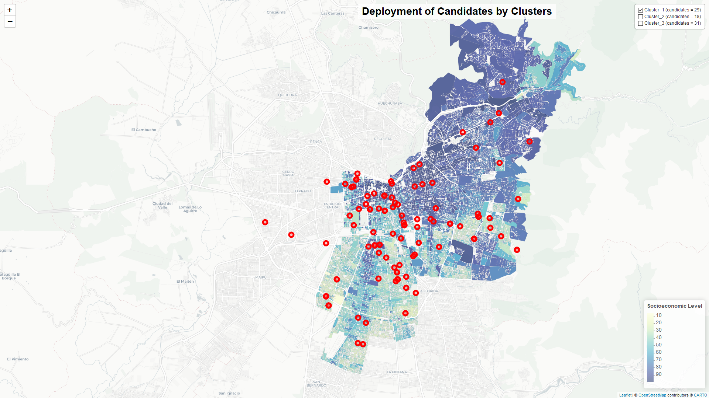

Deployment of Candidates by Clusters
================

### Load libraries

``` r
library(dplyr)
library(sf)
library(readr)
library(here)
library(leaflet)
library(htmlwidgets)
library(htmltools)
library(webshot)
```

### Load shapefiles and data

Shapefiles: Socioeconomic Level

``` r
ibt <- st_read(here("input","geo_data","ibt", "ibt_geo.shp"))
```

    ## Reading layer `ibt_geo' from data source `D:\2020_w\data_facebook\fb_ssrc_chile\input\geo_data\ibt\ibt_geo.shp' using driver `ESRI Shapefile'
    ## Simple feature collection with 54908 features and 4 fields
    ## geometry type:  POLYGON
    ## dimension:      XY
    ## bbox:           xmin: -70.83327 ymin: -33.65715 xmax: -70.45425 ymax: -33.30155
    ## CRS:            NA

Data: 1186 posts of deployment of 78 candidates

``` r
post_locs <- read_rds(here("proc","04_posts_geo_nse_cl_lf.rds"))
```

### Prepare shapefiles and data

Shapefiles: Socioeconomic Level

``` r
ibt <- ibt[!is.na(ibt$nse),]

ibt_10_11_13 <- ibt %>%
  
  filter(ibt, comuna %in% 
           c("PROVIDENCIA", "ÑUÑOA", "SANTIAGO","MACUL","SAN JOAQUÍN",
                            "LA GRANJA","LAS CONDES", "VITACURA", "LO BARNECHEA","LA REINA","PEÑALOLÉN",
                            "EL BOSQUE", "SAN RAMÓN", "PEDRO AGUIRRE CERDA","SAN MIGUEL","LO ESPEJO", "LA CISTERNA"))
```

Data: Filter by clusters.

``` r
post_locs_c1 <- post_locs %>%
  
  filter(cluster_sel=='C1 (n = 29)')


post_locs_c2 <- post_locs %>%
  
  filter(cluster_sel=='C2 (n = 18)')


post_locs_c3 <- post_locs %>%
  
  filter(cluster_sel=='C3 (n = 31)')
```

Change strings

``` r
post_locs_c1$cluster_sel[post_locs_c1$cluster_sel == "C1 (n = 29)"] <- "Cluster_1 (candidates = 29)"
post_locs_c2$cluster_sel[post_locs_c2$cluster_sel == "C2 (n = 18)"] <- "Cluster_2 (candidates = 18)"
post_locs_c3$cluster_sel[post_locs_c3$cluster_sel == "C3 (n = 31)"] <- "Cluster_3 (candidates = 31)"
```

### Define map elements

Popup by each cluster

``` r
popupc1 = paste0( "Candidate:"
                  , post_locs_c1$candidate
                  , "<br>"
                  ,"Party:"
                  , post_locs_c1$party
                  , "<br>"
                  ,"District:"
                  , post_locs_c1$candidate_district 
                  , "<br>"
                  ,"Cluster:"
                  , post_locs_c1$cluster_sel
                  ,"<br>"
                  ,"<a href='"
                  , post_locs_c1$link
                  , "' target='_blank'>"
                  , "Go to Post</a>"
)

popupc2 = paste0( "Candidate"
                  , post_locs_c2$candidate
                  , "<br>"
                  ,"Party:"
                  , post_locs_c2$party
                  , "<br>"
                  ,"District:"
                  , post_locs_c2$candidate_district 
                  , "<br>"
                  ,"Cluster:"
                  , post_locs_c2$cluster_sel
                  ,"<br>"
                  ,"<a href='"
                  , post_locs_c2$link
                  , "' target='_blank'>"
                  , "Go to Post</a>"
)

popupc3 = paste0( "Candidate:"
                  , post_locs_c3$candidate
                  , "<br>"
                  ,"Party:"
                  , post_locs_c3$party
                  , "<br>"
                  ,"District:"
                  , post_locs_c3$candidate_district 
                  , "<br>"
                  ,"Cluster:"
                  , post_locs_c3$cluster_sel
                  ,"<br>"
                  ,"<a href='"
                  , post_locs_c3$link
                  , "' target='_blank'>"
                  , "Go to Post</a>"
)
```

Add title and colors

``` r
tag.map.title <- tags$style(HTML("
  .leaflet-control.map-title { 
    transform: translate(-50%,20%);
    position: fixed !important;
    left: 50%;
    text-align: center;
    padding-left: 10px; 
    padding-right: 10px; 
    background: rgba(255,255,255,0.75);
    font-weight: bold;
    font-size: 28px;
  }
"))

title <- tags$div(
  tag.map.title, HTML("Deployment of Candidates by Clusters")
)  

pal2 <- colorNumeric(
  palette = "YlGnBu",
  domain = ibt_10_11_13$nse
)
```

### Leaflet Map

Create map

``` r
map1 <- leaflet() %>%
  
  addProviderTiles("CartoDB.Positron") %>%
  
  setView(lat=-33.4489, lng = -70.6693, zoom = 12) %>%
  
  addControl(title, position = "topleft", className="map-title")  %>%
  
  addPolygons(data = ibt_10_11_13, 
              
              fillColor = ~pal2(nse), 
              
              color = "#b2aeae",
              
              fillOpacity = 0.7,
              
              weight = 0.3,
  )  %>%
  
  addCircleMarkers(data=post_locs_c1,
                   
                   lng = ~lon, 
                   
                   lat = ~lat,
                   
                   color= "red",
                   
                   popup = popupc1,
                   
                   opacity = 4, 
                   
                   radius = 6,
                   
                   weight = 5,
                   
                   group ='Cluster_1 (candidates = 29)'
                   
  )  %>%
  
  addCircleMarkers(data=post_locs_c2,
                   
                   lng = ~lon, 
                   
                   lat = ~lat,
                   
                   color= "blue",
                   
                   popup = popupc2,
                   
                   opacity = 4, 
                   
                   radius = 6,
                   
                   weight = 2,
                   
                   group ='Cluster_2 (candidates = 18)'
                   
  ) %>%
  
  addCircleMarkers(data=post_locs_c3,
                   
                   lng = ~lon, 
                   
                   lat = ~lat,
                   
                   color= "yellow",
                   
                   popup = popupc3,
                   
                   opacity = 4, 
                   
                   radius = 6,
                   
                   weight = 5,
                   
                   group ='Cluster_3 (candidates = 31)'
                   
  ) %>%
  
  addLegend(pal = pal2, 
            
            values = ibt_10_11_13$nse, 
            
            position = "bottomright",
            
            title = "Socioeconomic Level" ) %>%
  
  
  addLayersControl(
    
    overlayGroups = 
      c('Cluster_1 (candidates = 29)',
        
        'Cluster_2 (candidates = 18)',
        
        'Cluster_3 (candidates = 31)'),
    
    options = layersControlOptions(
      
      collapsed = FALSE)) %>%
  
  hideGroup(c('Cluster_2 (candidates = 18)','Cluster_3 (candidates = 31)'))
```

### Save map

``` r
saveWidget(map1, file="index.html")
webshot(here("index.html"),vwidth = 1920, vheight = 1080, file = here( "04b_capture_map_clusters.png"),
       cliprect = "viewport")
```

<!-- -->

##### Ext

``` r
htmlfile <- list.files(pattern="\\.html$")
pngfile <- list.files(pattern = "\\.png$")
folder_index <- list.files("index_files")
file.copy(htmlfile, "output")
```

    ## [1] FALSE

``` r
file.copy(htmlfile, "output")
```

    ## [1] FALSE

``` r
file.copy(folder_index, "output")
```

    ## logical(0)

``` r
file.remove(htmlfile)
```

    ## [1] TRUE

``` r
file.remove(pngfile)
```

    ## [1] TRUE

``` r
file.remove(folder_index)
```

    ## logical(0)
