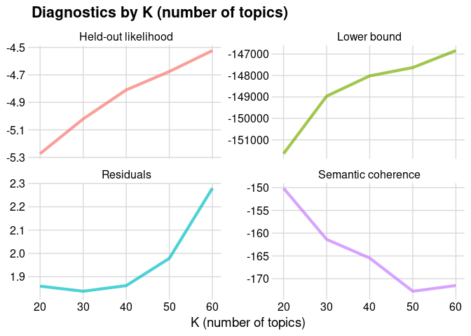
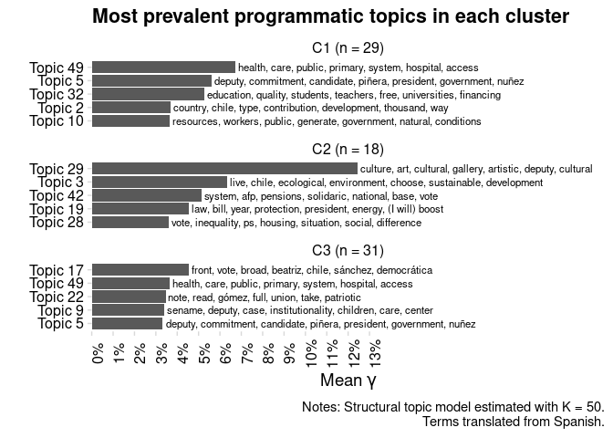

Estimate STM (structural topic model)
================

# Load packages and data

Packages:

``` r
library(tidyverse)
library(janitor)
library(scales)
library(tidytext)
library(stm)
library(ggthemes)
library(cowplot)
library(here)
```

``` r
set.seed(123)
theme_set(cowplot::theme_minimal_grid())
```

Data:

``` r
candidates <- read_rds(
  here("proc", "03_facebook_data_candidate_nse_cl.rds")
)
```

``` r
programmatic_posts <- read_rds(
  here("proc", "03_facebook_data_posts_nse_cl.rds")
) %>% 
  filter(str_detect(codif_macro_1, "^A") | str_detect(codif_macro_2, "^A"))
```

# Wrangle data into a `tidytext` format

Elements to clean text:

``` r
# URL regex. Source: https://stackoverflow.com/a/56974986
url_regex <- "http[s]?://(?:[a-zA-Z]|[0-9]|[$-_@.&+]|[!*\\(\\),]|(?:%[0-9a-fA-F][0-9a-fA-F]))+"

# Hashtags / mentions regex.
interactions_regex <- "[\\#\\@]\\S+"

# List of words in municipalities' names
# dictionary source: https://github.com/knxroot/bdcut-cl/tree/master/BD/CSV_utf8

municipalities_words <- read_csv(here("input", "BDCUT_CL__CSV_UTF8.csv")) %>% 
  clean_names() %>% 
  filter(region_id == 13) %>% 
  select(municipality_name = comuna_nombre, municipality_id = comuna_id) %>% 
  unnest_tokens(output = word, input = municipality_name, "words") %>% 
  # eliminar stop words
  filter(!word %in% stopwords::stopwords("es", "stopwords-iso"))

# List of words in candidates' names

names_words <- tibble(name = unique(programmatic_posts$candidate)) %>% 
  unnest_tokens(output = word, input = name, "words") %>% 
  distinct()
```

Create tidy dataset:

``` r
programmatic_posts_tidy <- programmatic_posts %>% 
  mutate(message = message %>% 
           str_remove_all(url_regex) %>% 
           str_remove_all(interactions_regex) %>% 
           str_squish()) %>% 
  unnest_tokens(word, message, "words") %>% 
  # remove numbers
  filter(!str_detect(word, "^[\\d\\.,]+$")) %>% 
  # remove stop words
  filter(!word %in% stopwords::stopwords("es", "stopwords-iso")) %>%
  # remove mentions to comunas
  filter(!word %in% unique(municipalities_words$word)) %>% 
  # remove mentions to candidates' names
  filter(!word %in% names_words$word) %>% 
  # only keep words with at least 10 overall mentions
  add_count(word) %>%
  filter(n > 10) %>%
  select(candidate_id, id_post, word)
```

# Run stm with different K (number of topics) specifications

The following uses code from:
<https://juliasilge.com/blog/evaluating-stm/>

Create sparse matrix:

``` r
programmatic_posts_sparse <-  programmatic_posts_tidy %>%
  count(id_post, word) %>%
  cast_sparse(id_post, word, n)
```

Run models:

``` r
many_models <- tibble(K = seq(20, 60, by = 10)) %>%
  mutate(topic_model = map(
    K,
    ~{
      message(.x)
      stm(programmatic_posts_sparse, K = .x, verbose = F)
    }))

write_rds(many_models, here("proc", "05_many_models.rds"))
```

``` r
many_models <- read_rds(here("proc", "05_many_models.rds"))
```

Generate diagnostics:

``` r
heldout <- make.heldout(programmatic_posts_sparse)

k_result <- many_models %>%
  mutate(exclusivity = map(topic_model, exclusivity),
         semantic_coherence = map(topic_model, semanticCoherence,
                                  programmatic_posts_sparse),
         eval_heldout = map(topic_model, eval.heldout, heldout$missing),
         residual = map(topic_model, checkResiduals,
                        programmatic_posts_sparse),
         bound =  map_dbl(topic_model, function(x) max(x$convergence$bound)),
         lfact = map_dbl(topic_model, function(x) lfactorial(x$settings$dim$K)),
         lbound = bound + lfact,
         iterations = map_dbl(topic_model, function(x) length(x$convergence$bound)))

p_diag_multiple <- k_result %>%
  transmute(K,
            `Lower bound` = lbound,
            Residuals = map_dbl(residual, "dispersion"),
            `Semantic coherence` = map_dbl(semantic_coherence, mean),
            `Held-out likelihood` = map_dbl(eval_heldout, "expected.heldout")) %>%
  gather(Metric, Value, -K) %>%
  ggplot(aes(K, Value, color = Metric)) +
  geom_line(size = 1.5, alpha = 0.7, show.legend = FALSE) +
  facet_wrap(~Metric, scales = "free_y") +
  labs(x = "K (number of topics)",
       y = NULL,
       title = "Diagnostics by K (number of topics)")

p_diag_multiple
```

<!-- -->

``` r
p_diag_scatter <- k_result %>%
  select(K, exclusivity, semantic_coherence) %>%
  filter(K %in% c(40, 50)) %>%
  unnest() %>%
  mutate(K = as.factor(K)) %>%
  ggplot(aes(semantic_coherence, exclusivity, color = K)) +
  geom_point(size = 2, alpha = 0.7) +
  ggthemes::scale_color_tableau() +
  labs(x = "Semantic coherence",
       y = "Exclusivity",
       title = "Comparing exclusivity and semantic coherence",
       subtitle = "For K = 40 and K = 50")
```

    ## Warning: `cols` is now required when using unnest().
    ## Please use `cols = c(exclusivity, semantic_coherence)`

``` r
p_diag_scatter
```

<!-- -->

We will keep the stm with K=50:

``` r
topic_model <- k_result %>% 
  filter(K == 50) %>% 
  pull(topic_model) %>% 
  .[[1]]

td_beta <- tidy(topic_model)
```

    ## Warning: `tbl_df()` is deprecated as of dplyr 1.0.0.
    ## Please use `tibble::as_tibble()` instead.
    ## This warning is displayed once every 8 hours.
    ## Call `lifecycle::last_warnings()` to see where this warning was generated.

``` r
td_gamma <- tidy(topic_model, matrix = "gamma",
                 document_names = rownames(programmatic_posts_sparse))
```

Now, we can obtain the most common terms per topic:

``` r
top_terms <- td_beta %>%
  arrange(beta) %>%
  group_by(topic) %>%
  top_n(7, beta) %>%
  arrange(-beta) %>%
  select(topic, term) %>%
  summarize(terms = list(term)) %>%
  mutate(terms = map(terms, paste, collapse = ", ")) %>% 
  unnest()
```

    ## `summarise()` ungrouping output (override with `.groups` argument)

    ## Warning: `cols` is now required when using unnest().
    ## Please use `cols = c(terms)`

``` r
gamma_terms <- td_gamma %>%
  group_by(topic) %>%
  summarize(mean_gamma = mean(gamma)) %>%
  arrange(desc(mean_gamma)) %>%
  left_join(top_terms, by = "topic") %>%
  mutate(topic_label = paste0("Topic ", topic),
         topic_label = reorder(topic_label, mean_gamma))
```

    ## `summarise()` ungrouping output (override with `.groups` argument)

``` r
td_gamma_complete <- td_gamma %>% 
  left_join(programmatic_posts_tidy %>% 
              select(document = id_post, candidate_id)) %>% 
  left_join(candidates %>% select(candidate_id, cluster_sel)) %>% 
  left_join(gamma_terms)
```

    ## Joining, by = "document"

    ## Joining, by = "candidate_id"

    ## Joining, by = "topic"

``` r
write_rds(td_gamma_complete, here("proc", "05_gamma_complete.rds"),
          compress = "gz")
```

``` r
topics_by_cluster <- td_gamma_complete %>% 
  filter(!is.na(cluster_sel)) %>% 
  group_by(cluster_sel, topic, topic_label, terms) %>% 
  summarize(mean_gamma = mean(gamma)) %>% 
  ungroup() %>% 
  arrange(-mean_gamma) %>% 
  group_by(cluster_sel) %>% 
  slice(1:5) %>% 
  ungroup()
```

    ## `summarise()` regrouping output by 'cluster_sel', 'topic', 'topic_label' (override with `.groups` argument)

``` r
## Recoding topics_by_cluster$terms into topics_by_cluster$terms_eng
topics_by_cluster$terms_eng <- recode(topics_by_cluster$terms,
  "salud, atención, pública, primaria, sistema, hospital, acceso" = "health, care, public, primary, system, hospital, access",
  "diputado, compromiso, candidato, piñera, presidente, gobierno, nuñez" = "deputy, commitment, candidate, piñera, president, government, nuñez",
  "educación, calidad, estudiantes, profesores, gratuita, universidades, financiamiento" = "education, quality, students, teachers, free, universities, financing",
  "país, chile, tipo, aporte, desarrollo, mil, forma" = "country, chile, type, contribution, development, thousand, way",
  "recursos, trabajadores, públicos, generar, gobierno, naturales, condiciones" = "resources, workers, public, generate, government, natural, conditions",
  "cultura, arte, cultural, galería, artísticas, diputado, culturales" = "culture, art, cultural, gallery, artistic, deputy, cultural",
  "vivir, chile, ecológico, ambiente, elige, sustentable, desarrollo" = "live, chile, ecological, environment, choose, sustainable, development",
  "sistema, afp, pensiones, solidario, nacional, base, votar" = "system, afp, pensions, solidaric, national, base, vote",
  "ley, proyecto, año, protección, presidenta, energías, impulsaré" = "law, bill, year, protection, president, energy, (I will) boost",
  "voto, desigualdad, ps, vivienda, situación, sociales, diferencia" = "vote, inequality, ps, housing, situation, social, difference",
  "frente, vota, amplio, beatriz, chile, sánchez, democrática" = "front, vote, broad, beatriz, chile, sánchez, democrática",
  "nota, leer, gómez, completa, unión, tomar, patriótica" = "note, read, gómez, full, union, take, patriotic",
  "sename, diputada, caso, institucionalidad, niños, cuidado, centro" = "sename, deputy, case, institutionality, children, care, center"
)
```

``` r
p_topics_by_cluster <- ggplot(
  topics_by_cluster, 
  aes(x = mean_gamma, 
      y = reorder_within(topic_label, mean_gamma, cluster_sel),
      label = terms_eng)
) +
  geom_col() +
  geom_text(hjust = -.01, nudge_y = 0.0005, size = 3) +
  facet_wrap(~cluster_sel, nrow = 3, scales = "free_y") +
  scale_x_continuous(expand = c(0,0),
                     limits = c(0, 0.24),
                     breaks = seq(0, 0.13, by = 0.01),
                     labels = scales::percent_format(accuracy = 1)) +
  scale_y_reordered() +
  cowplot::theme_minimal_grid() +
  theme(panel.grid = element_blank(), axis.text.x = element_text(angle = 90)) + 
  labs(x = expression(paste("Mean ", gamma)),
       y = "",
       title = "Most prevalent programmatic topics in each cluster",
       caption = "Notes: Structural topic model estimated with K = 50.\nTerms translated from Spanish.")

p_topics_by_cluster
```

<!-- -->

``` r
ggsave(here("output", "05_fig7_topics.png"), p_topics_by_cluster,
       width = 7, height = 5)
```
